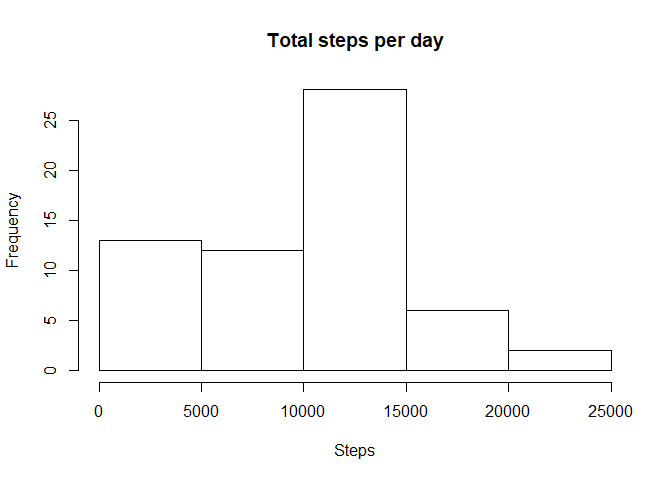
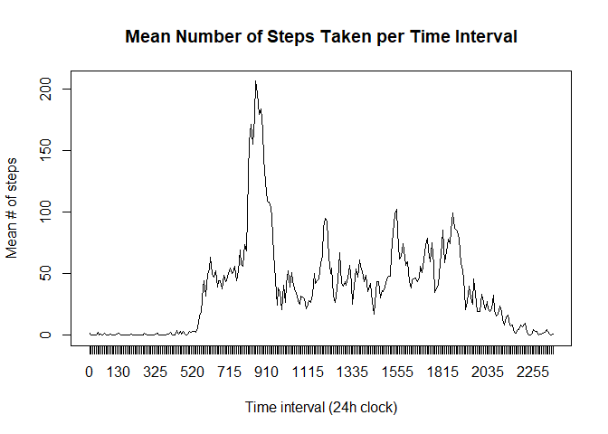
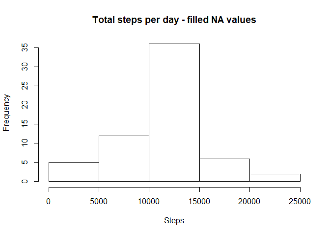

This report is meant to serve as an introduction to creating R markdown documents as a means to facilitate reproducible research. The following report will briefly detail the process of extracting, preparing, and plotting some rudimentary data from a human activity database

First, import the data:

```r
data=read.csv('C:/Users/leifs/Documents/repdata_data_activity/activity.csv')
```

Let's take a look at the data. We'll find the **total number of steps taken per day**, ignoring missing ('NA') values in the data for now. Plot the data as a histogram:

```r
total_steps_per_day=tapply(data$steps, data$date, sum, na.rm=T)
hist(total_steps_per_day, xlab='Steps', main='Total steps per day')
```

<!-- -->

Now let's see the **mean** and **median** of the total number of steps taken each day:

```r
mean_steps_per_day=mean(total_steps_per_day) #9354.23
median_steps_per_day=median(total_steps_per_day) #10395
```

Interesting. It would help a lot if we could visualize these data...so let's do so! Here we see the mean number of steps taken broken down by 5-min interval.


```r
mean_steps_time_interval=tapply(data$steps, data$interval, mean, na.rm=T)
plot(mean_steps_time_interval, xaxt='n', ylab='Mean # of steps', main='Mean Number of Steps Taken per Time Interval', xlab='Time interval (24h clock)', type='l')
axis(side=1, at=seq(1,length(unique(data$interval)), 1), labels=as.character(unique(data$interval)))
```

<!-- -->

```r
#Now we calculate the max of the mean steps, and report the time at which it occurs
max_mean_steps=mean_steps_time_interval[which(mean_steps_time_interval==max(mean_steps_time_interval))] #206.17 steps at 08:35 on the clock
```

As we can see, there is a sharp concentration of activity around (**08:35**). Next, we'll concern ourselves with the missing values in the datset.


```r
num_missing_steps=sum(is.na(data$steps)) #2304 missing values, encoded as NA
```

That's quite a lot of missing data! We should probably try to fill those values somehow. To do this, we'll fill missing step data at speific intervals by inputting the mean for each specific interval calculated from the other instances of that interval where data were extant:


```r
mean_step_data=cbind(mean_steps_time_interval, as.numeric(as.character(unique(data$interval))))
new_data=data

for (i in seq(1,length(data$steps),1)){
    
    if (is.na(data$steps[i])){
        
        new_data$steps[i]=mean_step_data[mean_step_data[,2]==data$interval[i],1]
        
    }
    
}

num_missing_steps=sum(is.na(data$steps)) #0
```

We now have zero missing values! Note that we have also created a new data.frame to store the original variables plus the imputations. If we look at a histogram of these data now, we see that there has been a shrinking of the left tail of the histogram and an increase in probability density near the centre:


```r
total_steps_per_day_filledNA=tapply(new_data$steps, new_data$date, sum, na.rm=T)
hist(total_steps_per_day_filledNA, xlab='Steps', main='Total steps per day - filled NA values')
```

<!-- -->

```r
mean_steps_per_day_filledNA=mean(total_steps_per_day_filledNA) #10766.19
median_steps_per_day_filledNA=median(total_steps_per_day_filledNA) #10766.19
```

Also note that the mean and median of these values differ from before we performed the imputation. 

Finally, let's consider a possible relationship between the day of the week and activity levels. We'll dichotomize into weekday/weekend. First, create a new factor variable in the new dataset coding for weekday or weekend:


```r
#Create a new factor for weekday
new_data$weekday=factor( weekdays(as.Date(as.character(new_data$date))) )
levels(new_data$weekday)[(levels(new_data$weekday)!='Saturday') & (levels(new_data$weekday)!='Sunday')]='Weekday'
levels(new_data$weekday)[(levels(new_data$weekday)=='Saturday') | (levels(new_data$weekday)=='Sunday')]='Weekend'
```

We can see that there are indeed differences in activity levels throughout the day on weeknds vs weekdays! Note that a new data.frame was created to hold the averaged values, so that the lattice plot would be less cumbersome to generate


```r
weekday_steps=with(new_data, tapply(steps, list(interval, weekday), mean))[,1]
weekend_steps=with(new_data, tapply(steps, list(interval, weekday), mean))[,2]

averaged_steps=c(weekday_steps, weekend_steps)
days=factor(c(rep('Weekday', length(weekend_steps)), rep('Weekend', length(weekend_steps))))
interval=c(unique(new_data$interval), unique(new_data$interval))

averaged_data=data.frame(steps=averaged_steps,
                         day=days,
                         interval=interval)
                         
library(lattice)
xyplot(averaged_data$steps~averaged_data$interval|averaged_data$day, type='l', layout=c(1,2),
       xlab='Interval', ylab='Number of steps')
```

<!-- -->

